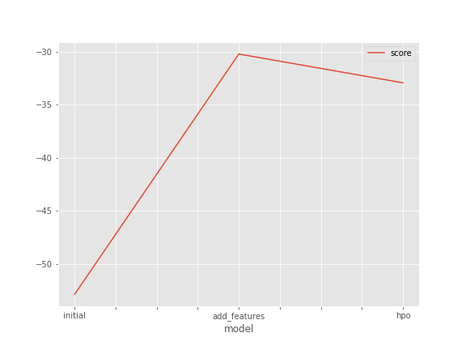
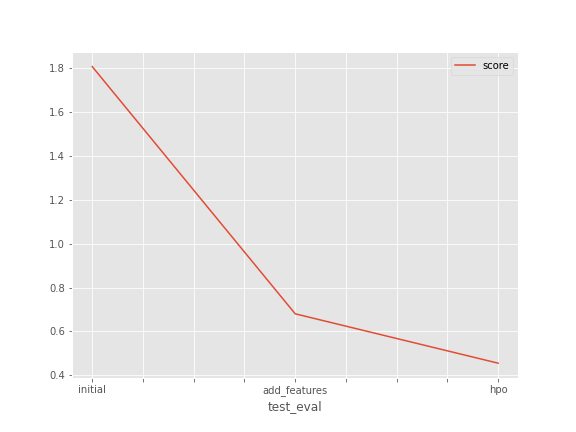

# Report: Predict Bike Sharing Demand with AutoGluon Solution
#### QIN HUANG

## Initial Training
### What did you realize when you tried to submit your predictions? What changes were needed to the output of the predictor to submit your results?
Kaggle would reject the submission if any of the prediction values was negative, as the prediction was about the count of bikes rented which could not be negative. All the negative prediction values were required to be set to zero for a successful submission.

### What was the top ranked model that performed?
The top ranked model during the initial training was WeightedEnsemble_L3.

## Exploratory data analysis and feature creation
### What did the exploratory analysis find and how did you add additional features?
Most of the training data was not from a holiday, and around one third of the training data was from a working day. Meanwhile, temp, atemp, humidity and windspeed all had an approximately bell-shaped distribution.

The datetime denoted a specific point in time and had a uniform distribution for the training dataset. This single feature could be made more powerful with feature engineering. Having the hour, day and month extracted from the datetime as additional features, the training dataset fed additional information to the ML model that could potentially uncover new patterns and yield better performance.

Correlation analysis and scatter plots did not suggest any strong correlation between featuers used for model training except for temp and atemp. We might look into removing one of them from the train dataset to reduce the complexity of the model training.

### How much better did your model preform after adding additional features and why do you think that is?
The model score improved by 22.59 and the Kaggle score improved by 1.13 after adding additional features.

The score improvement was potentially due to these new features, i.e. hour, day and month, providing additional useful information to the ML model and uncovering new insights. For example, the correlation between the prediction result and the hour, if there was any correlation, might be masked without the hour feature, as the datetime was always unique across the training dataset but the hour could be the same for different datetime values.

## Hyper parameter tuning
### How much better did your model preform after trying different hyper parameters?
The model score did not improve but the Kaggle score improved by 0.23 after hyperparameter tuning.

### If you were given more time with this dataset, where do you think you would spend more time?
If given more time, I would like to:

First, explore adding more additional features, such as day of the week, e.g. Sunday=0, Monday=1, Tuesday=2, etc, or time ranges in the day. Retrain the model to verify if the additional features improve model performance, e.g. if there's any patterns in bike renting across any specific day of the week or time ranges of the day.

Second, using the train dataset that has more additional features, try additional combinations of different hyperparameters, especially for the models that performed better with the default hyperparameter settings.

Third, explore more hyperparameter tuning packages that can auto-tune the hyperparameters and examine the tuning results.

### Create a table with the models you ran, the hyperparameters modified, and the kaggle score.
|model|hpo1|hpo2|hpo3|score|
|--|--|--|--|--|
|initial|default values|default values|default values|1.80454|
|add_features|default values|default values|default values|0.69574|
|hpo|BGM num_boost_round:100, num_leaves:[26,66], max_bin:31|XGB eta:0.25, max_depth: 8|CAT use_best_model:True|0.45513|

### Create a line plot showing the top model score for the three (or more) training runs during the project.

### Create a line plot showing the top kaggle score for the three (or more) prediction submissions during the project.

## Summary
In this project, I predicted the Bike Sharing Demand with AutoGluon using three different methods and submitted the prediction results to a Kaggle competition.

First, I downloaded the datasets from Kaggle, parsed the datetime column into datetime format ready to be used later for adding additional features, and examined some simple stats of the dataset features such as the min/max/variation. I then trained a model using AutoGluon's Tabular Prediction using the recommended settings and obtained a model score of -52.83 (eval_metric: RMSE) and a Kaggle score of 1.81.

Second, I added more features to the train dataset by extracting the hour, day and month from the datetime column. I also performed exploratory data analysis to examine the distribution and correlation of the feature values. I then trained a model with the same settings as before but with the additional features. There was a model score improvement of 22.59 and Kaggle score improvement of 1.13 after adding additional features. Note that temp and atemp appeared to be highly correlated and hence one of them could be removed from the train dataset to reduce the complexity of the training and potentially improve model performance.

Finally, I tuned some of the hyperparameters and further improved model performance. I started off by looking at some of the top performing models from the previous steps, e.g. CatBoost, LightGBM, ExtraTreesMSE, etc and included these models for hyperparameter tuning. I also included the XGBoost model which was not used by the AutoGluon in the previous steps to evaluate how it performed. Besides, I tried to add back some of the worst-performing models such as NN_TORCH with different hyperparameters to evaluate if it could perform better than previously. Furthermore, I tried to tune some of the non-model specific hyperparameters such as bagging and training time. It took a few iterations to identify the best combination of models and hyperparameters out of the limited combinations of hyperparameters that I have tried. With this specific problem to solve and the dataset provided, increasing or decreasing the num_bag_folds, increasing the time_limit and tunning the non-top performing models from the second step did not significantly improve model performance. Tuning hyperparameters for some of the top-performing models seemed to yield better results.

The hyperparameters after tuning were as follows. For LightGBM, the num_boost_round and num_leaves were chosen for reasonable training time and accuracy, while the max_bin was reduced to improve overfitting. For XGBoost, a smaller learning_rate and a larger max_depth were set to improve model accuracy. For CatBoost, use_best_model was set for best model quality as well. Collectively, the ensemble model based on the tuned individual models yielded a better performance. The WeightedEnsemble_L3 with hyperparameter tuning turned out to be the best performing model in this project. However, it was difficult to improve the Kaggle score to be below 0.45 from the tuning exercises done so far. Some further improvements could be adding additional features in the train dataset, removing temp or atemp, or further fine-tuning the model-specific or generic hyperparameters.

Note that the model score, which was produced using the train dataset, after hyperparameter tuning (-32.94) did not improve compared to the previous step's (-30.24). However, the Kaggle score, which was evaluated using the predicted result, did improve with hyperparameter tuning. One of the explanations for this discrepancy might be the overfitting with the train dataset.

In conclusion, performing exploratory data analysis and preparing the data is as important as training a model. Removing redundant features or adding additional and meaningful features could improve a model's prediction performance. On top of that, tuning and optimizing the hyperparameters could further enhance model performance. However, without the help of hyperparameter search packages, it might take quite a number of iterations to identify the combinations of hyperparameters that yield the best model performance.
